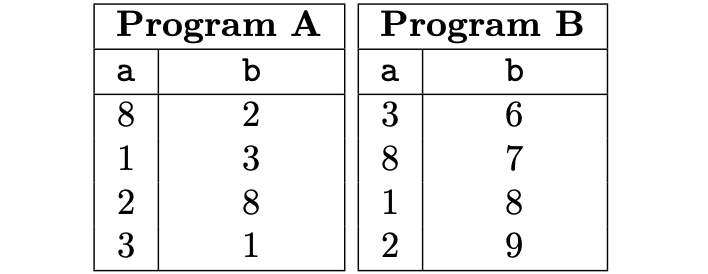

## Definition

Let $a = (a_1,...,a_n)$ and $b = (b_1, \dots , b_n)$ be any two vectors in $\mathbb{F}^n$. The vectors $a$ and $b$ are permutations of each other if there exists a bijective mapping (i.e., a permutation) $\sigma : [n] \to [n]$ such that $a = \sigma(b)$, where $\sigma(b)$ is defined by:

$$
\sigma(b)\ :=\ ( b_{\sigma(1)}, \dots , b_{\sigma(n)}).
$$

A protocol $(\mathcal{P}, \mathcal{V})$ is a **permutation argument** if the protocol can be used by $\mathcal{P}$ to prove to $\mathcal{V}$ that two vectors in $\mathbb{F}^n$ are a permutation of each other.

:::note

Unlike inclusion arguments, the two vectors subject to a permutation argument must have the same length.

:::

In the PIL context, the Plookup permutation argument between two columns $\texttt{a}$ and $\texttt{b}$ can be declared using the keyword "$\texttt{is}$" and using the syntax "$\mathtt{ \{ a \}\ is\ \{ b \}}$", where $\texttt{a}$ and $\texttt{b}$ do not necessarily need to be defined in different programs.

```
include "config.pil"; 

namespace A(%N);
pol commit a, b;

{a} is {b};

namespace B(%N);
pol commit a, b;

{a} is {Example1.b};
```

A valid execution trace with the number of rows $\texttt{N} = 4$, for the above example, is shown in the below table.



## Permutation Args over Multiple Columns

Permutation arguments in PIL can be written not only over single columns but over multiple columns as well.

That is, given two subsets of committed columns $\mathtt{a}_1, \dots , \mathtt{a}_m$  and  $\mathtt{b}_1, \dots , \mathtt{b}_m$ of some program(s), we can write $\{\mathtt{a}_1, \dots , \mathtt{a}_m\}\ \mathtt{is}\ \{\mathtt{b}_1, \dots , \mathtt{b}_m \}$ to denote that the rows generated by columns $\mathtt{b}_1 , \dots , b_m$ are a permutation of the rows generated by columns $\{\mathtt{a}_1, \dots , \mathtt{a}_m\}$. 

A natural application for this generalization is showing that a set of columns in a program is precisely a commonly known operation such as $\text{XOR}$, where the correct $\text{XOR}$ operation is carried out in a distinct program (see the following example).

```
include "config.pil"; 

namespace Main(%N);
pol commit a, b, c;

{a,b,c} is {in1,in2,xor};

namespace XOR(%N);
pol constant in1, in2, xor;
```

However, the functionality is further extended by the introduction of selectors in the sense that one can still write a permutation argument even though it is not satisfied over the entire trace of a set of columns, but only over a subset. 

Suppose that we are given the following execution traces:


Notice that columns $\{\texttt{a}, \texttt{b}, \texttt{c}\}$ of the program $\text{A}$ and columns $\{ \texttt{e}, \texttt{d}, \texttt{f}\}$ of the program $\text{B}$ are permutations of each other only over a subset of the trace. 

To still achieve a valid permutation argument over such columns, we have introduced a committed column $\texttt{sel}$ set to $1$ in rows where a permutation argument is enforced, and is $0$ elsewhere.

Therefore, the permutation argument will only be valid if, 

- $\texttt{sel}$ is correctly computed, and 
- the subset of rows chosen by sel in both programs shows a permutation.

The corresponding PIL code of the previous programs can now be written as follows:

```
namespace A(4);
pol commit a, b, c;
pol commit sel;

sel {a, b, c} is B.sel {B.e, B.d, B.f};

namespace B(6);
pol commit d, e, f; 
pol commit sel;
```

:::info Remark

The $\texttt{sel}$ column should be turned on (i.e., $\texttt{sel}$ set to $1$) the same number of times in both programs. Otherwise, a permutation cannot exist between any of the columns, since the resulting vectors would be of different lengths. This allows the use of this kind of argument even if both execution traces do not contain the same amount of rows.

:::